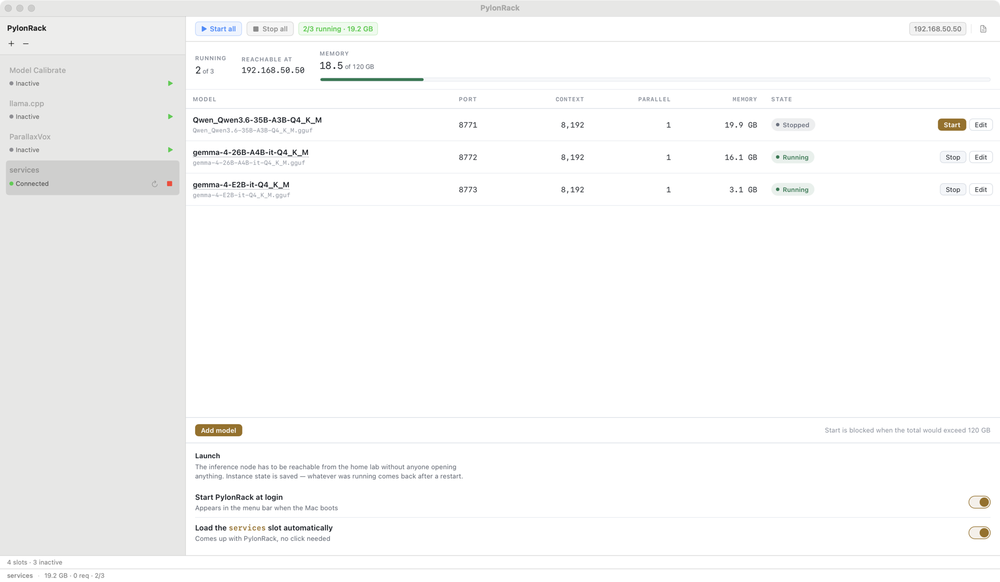

# pylonrack-services

PylonRack slot that runs several **llama.cpp** servers side by side and turns a
Mac into an inference node the rest of the network can use.

The [`pylonrack-llama`](https://github.com/marianvid/pylonrack-llama) slot is
built around one model at a time: pick it from a dropdown, start it, chat with
it. This slot answers a different question — *keep these models up, on these
ports, and bring them back after a reboot* — so the controls live in a table
rather than a header. Add as many as the machine has memory for.



---

## What it does

- **Several models at once**, each with its own port, host and parameters
- **Memory guard** — a start that would not fit is refused *before* spawning,
  not discovered afterwards when the machine begins to swap
- **State survives a reboot** — whatever was running comes back on its own
- **A model deleted from disk** becomes `Missing`, not an error, and the
  configuration is kept so the instance recovers if the file returns
- **Reachable from the network** — instances bind `0.0.0.0` by default, and the
  header shows the address other machines should actually use. An instance set
  to `127.0.0.1` is marked `LOCAL` in the table; the default is not marked,
  because a column repeating the same value on every row says nothing
- **Per-instance logs** — merged, or filtered to one model, with pause and
  clear; several servers writing at once are unreadable as a single stream

It does *not* download models, browse Hugging Face, or rebuild llama.cpp —
`pylonrack-llama` already does all three, and a second implementation of each
would only be a second thing to keep correct. Starting at login belongs to
PylonRack for the same reason.

---

## Requirements

- macOS 14+ (Apple Silicon recommended)
- Python 3.11+
- [PylonRack](https://github.com/marianvid/pylonrack)
- A compiled [llama.cpp](https://github.com/ggml-org/llama.cpp) — the slot runs
  `llama-server`, it does not build it
- GGUF models in a local Hugging Face cache

---

## Install

```bash
git clone https://github.com/marianvid/pylonrack-services
cd pylonrack-services
cp settings.example.json settings.json
```

Edit `settings.json` and point it at your machine:

```json
{
  "llama_bin": "/path/to/llama.cpp/build/bin/llama-server",
  "hf_cache":  "/path/to/HF_Cache/hub",
  "log_dir":   "~/.pylonrack/services",
  "ui_port":   8768,
  "instances": []
}
```

Then add the slot in PylonRack (Settings → Slots), pointing at this directory.
The first run creates `.venv` and installs the dependencies by itself.

To run it standalone, without the rack:

```bash
zsh start.sh
open http://127.0.0.1:8768/
```

---

## Ports

| Port | What |
|---|---|
| **8766** | the rack channel — PylonRack talks to the slot here |
| **8768** | the body panel: HTML over HTTP, live state over WebSocket |
| **8771–8829** | one per instance, assigned automatically |

`8765` belongs to `pylonrack-llama`, `8767` to `pylonrack-calibrate` and
`8769` to the ParallaxVox slot, so all of them can be loaded at once.
Change `port` in `rack.json` and `ui_port` in `settings.json` if either clashes
with something else on your machine.

---

## Using it

**Add a model** — the dialog lists every `.gguf` in the cache, marking the ones
already added. A path can also be typed for a model outside the cache. Defaults
on add: first free port, host `0.0.0.0`, context 8192, parallel 1, all layers on
GPU. Deliberately modest — a 128k context reserves memory whether you use it or
not.

**Edit** — every modelled `llama-server` parameter, in a dialog with Save and
Cancel. Save stays disabled until something actually changes. Changes to a
running instance take effect after a restart, and the slot says so rather than
pretending otherwise.

**Extra flags** — llama.cpp has dozens of options and modelling every one would
age badly, so the dialog ends with a free-form field appended verbatim to the
command line. This is where flags like `--reasoning off`, `--rope-scaling` or
`--cache-type-k q8_0` go. It is parsed with shell quoting rules, so
`--chat-template-file "/path/with spaces.jinja"` works as written.

**Start / Stop** — per instance, or all at once. `Start all` goes largest model
first, so the memory budget is spent on the big models instead of being
exhausted by small ones.

**The name of a running instance is a link** to that model's built-in llama.cpp
chat UI.

---

## The memory guard

The slot refuses to start an instance when the total would exceed

```
installed RAM − 8 GB reserved for the system
```

The sum uses the *model file size*, not resident memory: RSS lags during load,
and the guard has to answer before the memory is actually taken.

It therefore counts **model weights only**. The KV cache — which grows with
context and parallel slots — is on top, and can be several gigabytes per
instance at a large context. Leave room accordingly. Overriding the guard is
not offered: the failure mode it prevents is a machine that stops responding.

---

## Missing models

A `.gguf` that disappears from disk puts its instance into `Missing`:

- it is shown differently from `Error`, because an absence is not a fault
- the configuration is **kept, not deleted**
- `Relocate` accepts a new path; `Remove` deletes the instance
- if the file comes back on its own, so does the instance

State is re-derived from reality on every refresh rather than remembered, so a
process that dies on its own, or a file deleted while an instance sits idle,
shows up within two seconds instead of at the next confusing start failure.

---

## Security

`llama-server` has **no authentication by default**. On `0.0.0.0` that means
anyone on your network can send it work. On a home network that is usually
fine — but it is a decision, not an accident, and llama.cpp itself warns about
it on startup.

Two ways to tighten it:

- set **API key** per instance in the edit dialog, and use the same key from
  whatever calls the model
- set **Host** to `127.0.0.1` for instances that have no reason to leave the
  machine

---

## Layout

```
config.py        settings.json ↔ dataclasses, atomic writes, port allocation
instances.py     the process manager: spawn, readiness, memory guard, states
uiserver.py      HTTP + WebSocket for the body panel
server.py        the rack protocol and the shared command layer
ui/index.html    the body panel itself
tests/           43 tests, no network and no model loading required
docs/            ARCHITECTURE.md — how the pieces fit and why
```

The command layer is shared: the header buttons and the page call the same
functions, so the two can never disagree about what `start` means.

`model_scanner.py` and `parent_watchdog.py` are copied verbatim from
`pylonrack-llama`. That duplication is intentional — the alternative is a shared
package coordinated across separate repositories, which costs more than it
saves at this size.

---

## Tests

```bash
.venv/bin/python3 -m pytest tests/ -q
```

Nothing here touches the network or loads a model. The cases worth knowing
about:

- state is derived from reality — deleting a model file flips an instance to
  `Missing` with no restart
- the memory guard refuses an oversized start and permits a small one
- port allocation skips taken ports and raises when the range is full, instead
  of quietly reusing one
- the edit path coerces types, rejects garbage, and rejects a port already used
  by another instance
- settings survive a round trip, and unknown keys from a newer version are
  ignored rather than fatal
- a snapshot carries every editable field, so the edit dialog never invents a
  value it then saves back
- a snapshot never reaches the network — the metrics it shows are measured by a
  background thread, so an unresponsive server cannot stall the interface

Nothing in the suite depends on what happens to be running on the machine: the
port probe is stubbed by default and covered by a test of its own.

For the reasoning behind the design, see
**[docs/ARCHITECTURE.md](docs/ARCHITECTURE.md)**.

---

## Licence

MIT
